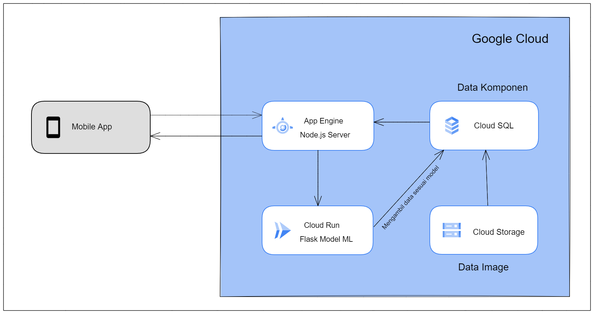

# Deploying to GCP

Here are the steps to manually deploy our back-end to Google Cloud Platform. Every command is run in Cloud Shell unless specified otherwise.

GCP services used:
- App Engine
- Cloud Run
- Cloud SQL
- Cloud Storage

## GCP architecture


  
## Set environment variables and enable services

```bash
export PROJECT_ID=$(gcloud config get-value project)
export PROJECT_NUMBER=$(gcloud projects describe $PROJECT_ID --format='value(projectNumber)')
export REGION=asia-southeast2

gcloud services enable \
    sqladmin.googleapis.com \
    run.googleapis.com 
```

## GCS setup

1. Make Bucket.

```
gsutil mb -l asia-southeast2 -b on gs://<replace with unique name for save mysql file>
```

2. Upload the .sql file provided to the created bucket.
 
## Cloud SQL setup

1. Create MySQL instance.

   ```
   gcloud sql instances create elektronio-sql \
     --project=$PROJECT_ID \
     --database-version=MYSQL_8_0 \
     --cpu=2 \
     --memory=4GB \
     --region=$REGION \
     --root-password=elektronio
   
3. Create database.

```
gcloud sql databases create elektronio --instance=elektronio-sql
```

3. Import MySQL database.
 
     1. Click elektronio-sql instance.
     2. Click import from the top menu.
     3. Browse and select the .sql file uploaded before.
     4. For destination, choose elektronio-db.
     5. Click import.
        
5. Show SQL instance IP, copy and save for later use.
```
gcloud sql instances describe elektronio-sql \
        --format=json | jq \
        --raw-output ".ipAddresses[].ipAddress"
```

7. Add Cloud SQL Client role to Compute Engine service account.
   
## Node.js web server with App Engine

- in local

    1. Clone project repo from GitHub.

    ```
    git clone 
    ```
       
    2. Replace <> with with the previous SQL instance IP in database.js.
  
    3. Deploy ke App engine

    ```

    ```
    
- in gcp 
```

## Flask With Cloud Run

Build and push Docker image.
```
cd flaskdeploy
docker build -t gcr.io/$PROJECT_ID/project-ml:v1 .
docker push gcr.io/$PROJECT_ID/project-ml:v1
```
